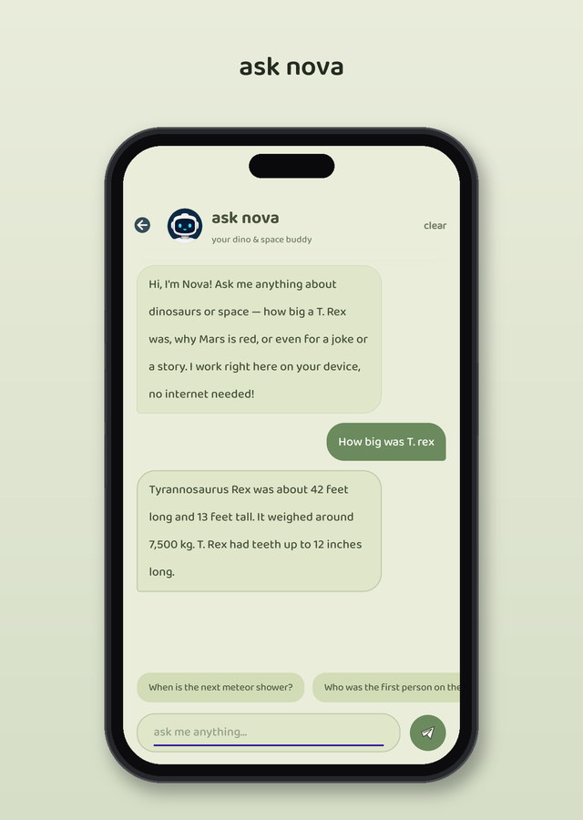

<h1 align="center">NovaSaur</h1>

<p align="center">
  An offline LLM inference engine for .NET MAUI Android apps.<br>
  Run Google's Gemma directly on-device — no internet, no servers, no API keys, no per-request cost.
</p>

NovaSaur is a lightweight bridge that lets any .NET MAUI Android app run a large language model entirely on the user's device. It wraps Google's **LiteRT-LM** runtime and exposes it to C# through a clean JNI bridge, so an app can load a model and ask questions with just a few calls.

## Why on-device

- **Fully offline** — works on a plane, in a basement, anywhere with no signal
- **Private by design** — nothing the user types ever leaves the device
- **Zero cost** — no API bills, no rate limits, no backend to maintain
- **No accounts, no keys** — drop in the model and it just runs

## Architecture

NovaSaur sits between managed C# code and the native inference runtime. The app talks to a single entry point; everything below it is handled internally.

```
Your .NET MAUI app  (C#)
        │
        │  JNI bridge
        ▼
NovaSaurModule.java     — public entry point (init / ask / askStream / reset / isReady)
        │
        ▼
NovaSaurBridge.java     — singleton, manages the model lifecycle
        │
        ▼
Gemma4Engine.kt         — wraps LiteRT-LM; loads the model and runs inference
```

Three design rules keep the engine reliable on real phones:

- **Every question is independent.** A fresh conversation is created per question and closed right after — and after each answer the engine reloads itself via `reset()`. LiteRT-LM draws all conversations from one shared token budget, so a long-lived engine simply stops answering after a handful of questions; the per-answer reload means question 50 behaves exactly like question 1.
- **The prompt is sacred.** No system prompt or rewriting happens on the native side — whatever the C# layer builds reaches the model untouched.
- **Self-healing.** A reset also follows any timeout or failure, so a wedged inference recovers on its own instead of requiring an app restart.

## Integration

**1. Get a model.** NovaSaur runs Gemma in LiteRT-LM's `.litertlm` format (about 2.5 GB). Accept Google's license on Hugging Face, download the model, and deliver it to the device — see below for how that works at Play Store scale.

**2. Build the library.** Open `android/` in Android Studio, sync Gradle, and build the AAR.

**3. Wire it into your app.** Bind the AAR in your MAUI project, then:

- `init(context)` once, off the UI thread, to load the model
- `isReady()` to check before asking
- `ask(question)` for a full answer, or `askStream(question, callback)` for token-by-token streaming
- `reset()` after each answer (in the background), so the next question starts against a clean engine

That's the whole public surface. A production-grade C# wrapper (single-flight init, timeouts, serialized inference) ships in [`samples/dotnet-maui`](samples/dotnet-maui).

## Shipping a 2.5 GB model

Large-model delivery is solved in production the way DinoSpace does it:

- **Google Play install** — the model ships as **Play Asset Delivery** packs (split into 1 GB chunks to stay under Play's per-pack cap) and is assembled on-device on first run.
- **In-app download** — installs without the packs offer the model as a user-started download, with pause/resume that survives app restarts and a remove option to free the space back up.

The full pattern: [docs/MODEL_DELIVERY.md](docs/MODEL_DELIVERY.md).

## Docs

- [ARCHITECTURE.md](docs/ARCHITECTURE.md) — the full stack, lifecycle, threading, and the reliability rules learned from real-device failures
- [PROMPTING.md](docs/PROMPTING.md) — how to prompt a small quantized model (and when not to call it at all)
- [MODEL_DELIVERY.md](docs/MODEL_DELIVERY.md) — shipping a 3 GB model through Google Play

## Requirements

- Android 8.0+ (API 26)
- 6 GB+ RAM recommended
- CPU inference — response time scales with device performance

## In production

NovaSaur powers **Ask Nova** in [**DinoSpace**](https://github.com/Karthikeya0923/dinospace), a kids' dinosaur & space encyclopedia on Google Play. An instant local answer layer sits in front of the model and handles anything askable by name; the model takes the genuinely open-ended questions. That answer layer is gated by DinoSpace's in-repo harness, which replays **1.3 billion generated questions** through the exact production pipeline — every entry and alias across dozens of question shapes, typo and casing gauntlets included — and must pass clean before a build ships.

<p align="center">
  
</p>

Building something with NovaSaur? Open an issue.

## License

GPL-3.0 — see [LICENSE](LICENSE).
